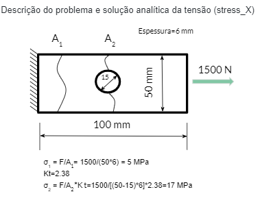
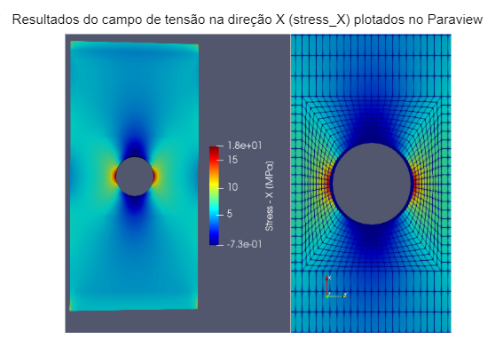

# Linear_FEM_Python

* Código FEM para análise linear.
* Pré processamento: Pode ser realizada no Salome ou Gmsh. 
* Pós-processamento: O arquivo de saída gerado pode ser utilizado no Paraview.

Exemplo de resultados - Placa com furo central:
	 

	 

	 

## Etapas para configuração da Análise 

1.	Primeiro deve ser informado o nome do arquivo contendo a malha. Atualmente está implementado elemento 3D hexaédrico (Brick8) e 2D quadrangular (Quad4). 
    Os arquivos devem estar no formato .med (Salome) ou no formato .inp (Gmsh-Abaqus).
    A configuração do nome do arquivo é feita no dicionário config_mesh, com a chave “mesh_file_name”, conforme exemplo abaixo. 

		Exemplo: config_mesh['mesh_file_name']='cube1000_bending.inp' 

2.	 Informar valores das condições de contorno (BC) para cada grupo de condição de contorno criado no gerador de malha. 
     O código está preparado para receber valores de deslocamento (condições de Dirichlet) e de força nodal pontual (condições de Neumann) nas direções X, Y e Z. Os vetores seguem o seguinte padrão: 
	
	Configuração para BC do tipo Neumann nodal nas direções X, Y e Z:
		config_mesh['BC_Neumann_point_X_']         
		config_mesh['BC_Neumann_point_Y_']           
		config_mesh[‘BC_Neumann_point_Z_’]
	
	Configuração para BC do tipo Dirichlet nodal nas direções X, Y e Z:
		config_mesh['BC_Dirichlet_X_']             
		config_mesh['BC_Dirichlet _Z_']            
		config_mesh['BC_Dirichlet_Y_']

	Os valores devem ser fornecidos em um vetor que relaciona o nome da condição de contorno com o respectivo 
	grupo criado. Por exemplo, em um caso onde foram criados dois grupos do tipo “BC_Neumann_point_X_”, onde o 
	primeiro  grupo tem valor aplicado de 100N e o segundo 200N, o vetor informado deve ser da seguinte forma: 
	
		config_mesh['BC_Neumann_point_X_']=np.array([100, 200])
	
	Observe que o “BC_Neumann_point_X_” carrega os valores de todos os grupos do tipo BC_Neumann_point_X_.

	Atenção: A nomeação dos grupos no gerador de malha deve seguir o seguinte padrão: 
    
		Grupo 1 do tipo Neumann pontual: BC_Neumann_point_X_0 
		Grupo 2 do tipo Neumann pontual: BC_Neumann_point_X_1.
		Continua até o grupo N desejado

		Grupo 1 do tipo Dirichlet: BC_Dirichlet_X_0 
		Grupo 2 do tipo Dirichlet: BC_Dirichlet_X_1. 
		Continua até o grupo N desejado

3.	Informar tipo de Análise (3D ou plane stress): 
		
		
		
		Exemplos:
		
		3D Análise:
			config_mesh['analysis_dimension']='3D'
		
		ou
		
		2D Análise - Estado plano de tensão:
		config_mesh['analysis_dimension']='2D_plane_stress'
		3.a Para análise 2D é necessário informar o valor de espessura de cada grupo de elementos. 
			Estes valores são informados no vetor config_mesh['Thickness_Group_']
			
			Caso existam elementos com espessuras diferentes, devem ser criados grupos no gerador de malha para cada valor de espessura. 
			Ex: Supondo que a geometria apresente regioes com espessura de 6 e 4. Nessas condições os seguintes grupos de superficie devem ser criados:
				Grupo 1 de espessura contendo todos elementos de espessura 6: Thickness_Group_0 
				Grupo 2 de espessura contendo todos elementos de espessura 4: Thickness_Group_1
				Continua até o grupo N desejado																

				
				Neste caso contendo dois grupo, no código o vetor será o seguinte: 
				config_mesh['Thickness_Group_']=np.array([6,4])
 
			Obs: Caso não sejam criados grupos de espessura, será assumido que a malha tem espessura uniforme. 
			Nesse caso deve ser informado apenas um valor no vetor config_mesh['Thickness_Group_'].
			
			
4.	Configurar o modelo constitutivo 
		
	4.a	Informar o modelo constitutivo: 
        
		Modelos implementados: Elasticidade linear isotrópica 3D;  Estado plano de tensão linear isotrópico 2D
        
		Exemplos:

		Elasticidade linear isotrópica 3D:
		import linear_elasticity_iso_3D 
		material_model=linear_elasticity_iso_3D
		
		Exemplo modelo 2D (plane_stress):
		import plane_stress_lin_elast_iso_2D
		material_model=plane_stress_lin_elast_iso_2D
		

	4.b	Informar parâmetros materiais elásticos: Módulo elástico e coeficiente de Poisson no vetor numpy mat_prop. A primeira posição é o módulo de elasticidade, a segunda corresponde ao Poisson.
      
	     mat_prop=np.array([210E3,0.29])

5.	Informar nome do arquivo de saída.
		
		Exemplo: out_file_name='FEM_out'
		
		Obs: Por default os dados são salvos no formato .vtk. Este formato pode ser lido facilmente no paraview. 
		
